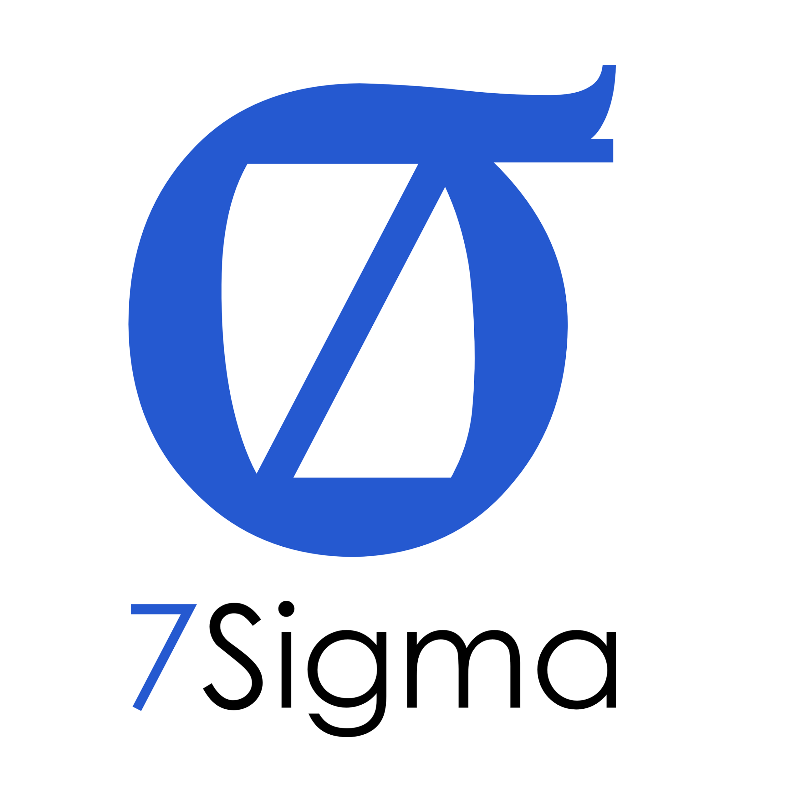

    
    <h1>Full-Service Cloud & Development Management</h1>

## Overview

7Sigma LLC provides end-to-end cloud application development, meeting businesses where they are to deliver secure, scalable solutions. With decades of experience, we support clients through every stage of their product journey—from concept and development to ongoing support and management. For companies without in-house tech teams, 7Sigma turns ideas into reliable, market-ready products.

---

## Core Services

### **1. Blue Sky Build: From Concept to Launch**
Our **Blue Sky Build** services take your idea from inception to a fully realized, production-ready product. This process includes:

- **Project Scoping**: Light Scoping, Comprehensive Scoping, and Proof of Concept (PoC) services to tailor project plans, requirements, and resources.
- **Core Build Package**: Full-stack development, UI/UX design, system architecture, backend development, security, and documentation.
- **DevOps & Deployment**: Automated deployment, CI/CD pipelines, and infrastructure setup for seamless go-live.

For more details, see our [**Blue Sky Build Services Overview**](./BlueSky.md).

### **2. Cloud Operations Services: Management & Maintenance**
Once your product is live, our **Cloud Operations Services** provide continuous management and support for production and development environments, including:

- **Environment Management**: Uptime, scaling, database optimization, log management, and security updates.
- **Security & IT Services**: Regular audits, penetration testing, and cost management to keep your system secure and efficient.
- **Service Level Agreements (SLAs)**: Customized SLAs for ticket responses, production incidents, and after-hours support.

Explore our [**Cloud Operations Services**](./CloudOps.md) for ongoing environment management.

### **3. Ongoing Maintenance & Development: Continuous Improvement**
Our **Ongoing Maintenance & Development Services** keep your product evolving and optimized through:

- **Bug Fixes & Issue Resolution**: From UI adjustments to major infrastructure performance updates.
- **Feature Development & Enhancements**: Adding new features, refining UX/UI, and code optimization.
- **Support & Consultation**: Ongoing technical guidance, documentation updates, and user training.

For continuous product enhancement, review our [**Ongoing Maintenance & Development Services**](./OngoingDev.md).

---

## Why Choose 7Sigma?

- **Experienced Founder & Hands-On Architect**: Led by a seasoned architect and engineer with decades in cloud and software development, 7Sigma offers direct access to the expertise that drives each project.
- **Personalized, High-Touch Service**: Clients work directly with the lead architect, ensuring that every solution is aligned with their needs and built to last.
- **Scalable & Secure Solutions**: We design for growth and resilience, creating systems that are secure, scalable, and ready for the demands of today and tomorrow.
- **Flexible Engagement Options**: Whether it's a full-scale build or focused technical support, our approach adapts to fit the unique needs of businesses at any stage.

---

## Quick Navigation

Explore each area of our services in more depth:

- [About Us](./about.md)
- [Blue Sky Build Services Overview](./BlueSky.md)
- [Cloud Operations Services Overview](./CloudOps.md)
- [Ongoing Maintenance & Development Services](./OngoingDev.md)
- [Engagement Process](./engagement.md)

For companies looking for a tech partner who understands the unique challenges of enterprise-grade software, 7Sigma LLC is here to support you every step of the way—from planning and building to managing and enhancing.

--- 
